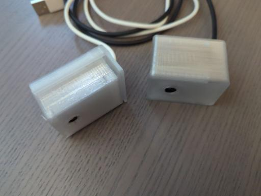

# ESPHome Configuration for the ESP32-CAM Module

I had some ESP32-CAM Modules lying around without any useful application.
To play around with ESPHome I created this config to integrate these thingys as webcams into my home assistant

One of the housings is from [Thingiverse](https://www.thingiverse.com/thing:5237167), the other... I dont know anymore :-(

